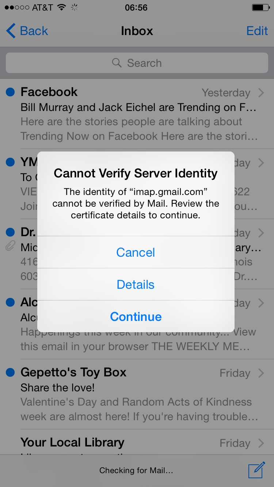

  <a class="cta-banner-pdf" href="https://info.nowsecure.com/IRforAndroidandiOS_PDFRequest.html">Read PDF<i class="fa fa-file-pdf-o"></i></a>
  <a class="cta-banner-update" href="https://info.nowsecure.com/IRforAndroidandiOS_Updates.html">Receive Updates<i class="fa fa-bell-o"></i></a>

# Compromise of company executive's phone
Another mobile scenario an incident response analyst may encounter is the potential compromise of an executive's phone. Mobile devices have become very personal, and individuals are acutely aware of minor changes in their device's behavior. When an executive's mobile device is acting strangely, many times its owner will turn the device over to the IT or security team for investigation.

These are incredibly challenging cases because so many different factors can cause a device to act in a different manner. Very few organizations have the [continual analysis tools](../tools/mobile-ir-tool-categories.md) in place to help understand how a device's state has changed over time.

Finally, another challenge is that company executives tend to be incredibly busy, glued to their mobile phones, and, often times, impatient. This is clearly an area where incident response teams want to ensure they have the proper tools and training in place to quickly identify and remediate incidents.

## Invalid email certificate case study
The CEO and the co-founder of a technology company experienced problems syncing their email over a weekend in early 2016. When the iOS Mail app was launched, it would intermittently throw a certificate error. In this particular case, the CEO was technical and actually captured screenshots, which are very helpful in determining the specific errors that occurred:

>Cannot Identify Server Identity

>The identity of "imap.gmail.com" cannot be verified by Mail. Review the certificate details to continue.

The Gmail app for iOS would not sync email either, but it dropped the connection silently.

The certificate was self signed and had a common name of "servers.afyonn.com," and it was set to expire in Oct 2016:

## Additional investigation
Since this anomaly impacted two specific devices, further analysis was warranted. The CEO reported an incident to the company's security team, which performed additional data collection and analysis.

It was determined that a non-standard DNS server was active at the executive's home. This DNS was located outside of the country and was not part of the infrastructure of their Internet service provider (ISP).

The home router was inspected and several security issues were discovered including a default, publicly known password and some remote management interfaces being enabled.

The team was able to capture the TLS negotiation at a later time so that the full certificate chain was available for inspection.

## Inconclusive findings
Clearly, an incident of concern occurred involving the CEO's devices. Like many incidents, it was difficult to determine the root cause. The steps proposed by the incident response team included:

* Take the home router offline
* Analyze the router for signs of compromise
* Attempt to capture the incident live and collect more data
* Forensically acquire and analyze the devices
* Wipe the devices and re-provision them
* Issue a new home router and secure it according to best practices

The investigation benefited from the individuals involved being security aware. However, this scenario is not common. Even with the technical capabilities of the impacted individuals, it still took several days to identify, analyze and remediate the incident.
